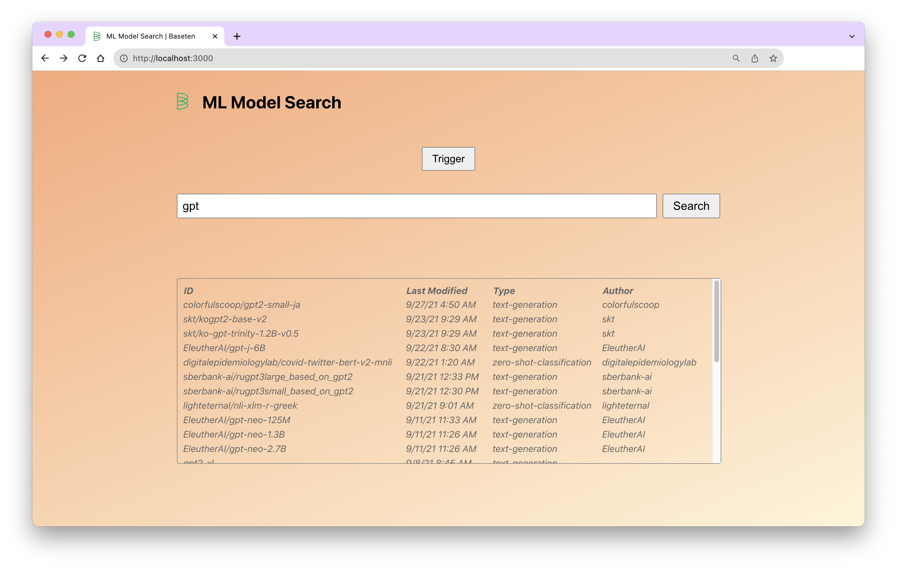

# Baseten Frontend Take-Home Challenge

This project mimics the functionality of Spotlight search on Mac OS. It is launched by a Trigger button and allows for searching from within a list of ML models. Results can be selected by clicking or using keyboard shortcuts.


## Assignment Requirements

### Basic Requirements

- Clicking the _Trigger_ button should launch the UI component to capture user input.
- UI component should consist of a text input as well as an area to display results matching user input.
- Matching results based on the text input are displayed below the text input as a list in alphabetical order by `modified` (most recent modified first).
- Each result should be selectable by mouse click as well as using the{" "} `↑` / `↓` arrow keys (and{" "} `↵`).
- Upon selection, should update the _Selected Output_ area with the selected value.

### Nice-to-have Requirements

- UI component can also be launched via a hotkey combination{" "} `⌘`+`K` or `Ctrl`\+ `K`.
- Hitting the `Esc` key will close the UI component without selecting anything.
- Results are grouped by `type` and displayed under an appropriate `type` heading. _(See Future Work section for how I would implement this.)_

## Installation

1. Clone this repo
2. Install dependencies

```
$ npm install
```

3. Start the dev server

```
$ npm run start
```

4. The project will be running locally at http://localhost:3000/.

## Technical Design Decisions



- I introduced a search context provider because the `selected` and `setSelected` state methods were called from various components in the app. Using context would be more necessary if the state was used in multiple layers of nested components, but even here it’s helpful for code cleanliness.
- I used the Luxon library for displaying the last modified date. Although there’s just one place in which it’s called, it’s easier to understand than a custom date function would be. It also provides localization (e.g. saying 2:00 PM versus 14:00).
- I memoized components to prevent them from being re-rendered when their state didn’t change
- I added the escape and command/control+k event listeners globally because they need to work no matter what element is currently in focus. The up arrow, down arrow, and enter handlers are just tied to the `SearchResults` component.
- Search is not cleared when hiding and re-showing the component. This is consistent with Spotlight search behavior.

## Future Work

Here are some updates I would make if I were building this for production instead of as an MVP:

- Testing: I updated the `App.test.tsx` test so that it checks for text that is in the App component header rather than in the placeholder. I would build out a full suite of tests, both for each UI component and for logic (such as the work done in the search API to transform search results before returning them)
- Responsiveness: I focused on how the app looks on desktop because a feature like this (whether it’s a part of Baseten’s platform or whether it’s like Spotlight search on Mac OS) would usually be used on desktop. However, if I were launching this to production I’d want to ensure it looked good on all viewport sizes.
- Arrange results by type: To complete this stretch goal, I would use a method like `Array.reduce` to organize the results into an array of arrays where the keys is the ML model type and the value is an array of objects of all models of that type. Instead of creating `SearchResult` components directly in `SearchResults`, I would then introduce a new component instantiated in SearchResult called `SearchResultGroup`. `SearchResultGroup` would take in a model type and array of models of that type. It would display the model type as a table header and would iterate through the array of models, creating a `SearchResult` component for each model.
- Custom hooks: Introduce custom hooks for any logic that might be reused. This also helps to make component code more readable.
- File structure: Organize components into a `Components` directory. If custom hooks are created, put them in a hooks directory.
- Consider using a table library like React Table, especially if we wanted to introduce more functionality for the table like filtering or sorting. This could also help to make table styling easier.
- General CSS updates: Highlighting the selected table row, introducing transitions like having the search component fade in and out rather than just appear
- Store all strings in a strings file and access them via a translation library. Even if the app will not be translated right now, it’s a good practice to not have strings directly in the code.
- Instead of doing all data manipulation in a `search` method in the API endpoint, introduce helpers. This is especially important if there will be multiple use cases for search that may need different parameters passed in or different data formats for responses.
  If desired from a product perspective, introduce infinite scroll or search results auto-populating as the query is input (as with Spotlight).
